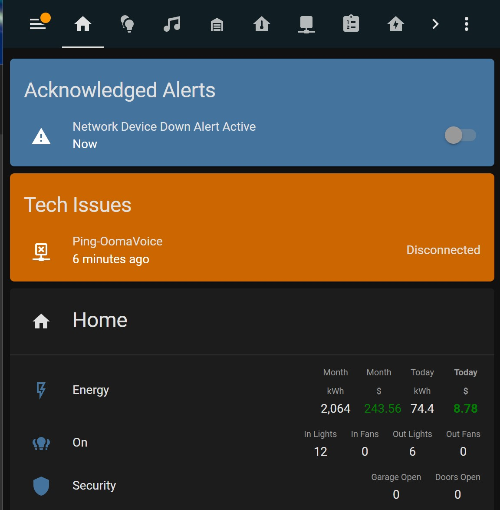

# Simple and Effective Alerting

I searched for a long time to find an approach for alerts and notifications that was simple, robust, and repeatable.  There are a lot of good tools, but having a well thought out strategy for various situations is just as important as the tools.  

    

## Alert and Notification Concepts

### Categories of Alerts
* Information (INFO)
* Warning (WARN)
* Critical (CRIT)

### Methods
* Allow simple toggle on / off for each alert
* Display colored cards on dashboard / hide when not active
* Send individual notification when required
* Send repeat notifications at set intervals while active
* Allow acknowledgement of alerts to supress further notifications

### Alert Integration

The Alert integration is both simple and powerful. At first glance it seems limited, but spending some time with it I found it to be extremely under rated.
https://www.home-assistant.io/integrations/alert/

### Notification groups

I recommend using notification groups which make future changes and maintenance to your alerts very easy.  https://www.home-assistant.io/integrations/notify.group/

```yaml
#################################  Notify  ###################################
notify:
  - name: STD_Information
    platform: group
    services:
      - service: mobile_app_chads_phone
  - name: STD_Warning
    platform: group
    services:
      - service: mobile_app_chads_phone
      - service: mobile_app_carens_phone
  - name: STD_Critical
    platform: group
    services:
      - service: mobile_app_chads_phone
      - service: mobile_app_carens_phone
      - service: gmail_alert
```

## Informational

### Possible issues like unknown devices (INFO)
* Display
  * Card is shown on dashboard when specified devices have "Unknown" state

This doesn't require any backend configuration and doesn't do any notification.  It just displays the card by using the auto-entities card.  See the lovelace configuration for details


### Garage door(s) are open (INFO)
* Input Boolean turns on/off the alerts
* Display
  * Card is shown on dashboard as soon as garage door is open
* Notification
  * Notification occurs after 180 minutes and repeats every 180 minutes
  * Acknowledging alert stops further notifications
  * RESOLVED notification once alert is no longer active
  * Automation at 10:30PM, if alert is active send notification at that time

    

```yaml
group:
  Garage Doors:
    entities:
      - binary_sensor.garage_door_1
      - binary_sensor.garage_door_2

input_boolean:
  garage_door_notify:
    name: Garage Door Notify
    icon: mdi:information

template:
  - binary_sensor:
      - name: Garage Door Alert Active
        state: "{{ is_state('group.garage_doors', 'on') and is_state('input_boolean.garage_door_notify', 'on') }}"

alert:
  garage_door_info_alert_active:
    name: Garage Door Alert Active
    entity_id: binary_sensor.garage_door_alert_active
    state: "on"
    repeat:
      - 180
    can_acknowledge: true
    skip_first: true
    title: "7580 Info - Garage Door Open"
    message: >
      Garage Door open for {{ relative_time(states.binary_sensor.garage_door_alert_active.last_changed) }} \  
      Alerts on: {{ expand('group.garage_doors') | selectattr('state', 'eq', 'on') | map(attribute='attributes.friendly_name') | list | join(', ') }} \ 
      Triggered: {{ as_timestamp(states.binary_sensor.garage_door_alert_active.last_changed) | timestamp_custom('%A %I:%M%p (%d-%b-%Y)') }}
    done_message: "Garage Door Alert RESOLVED at {{ as_timestamp(states.binary_sensor.garage_door_alert_active.last_changed) | timestamp_custom('%A %I:%M%p (%d-%b-%Y)') }}"
    notifiers:
      - STD_Information

automation:
  - alias: Nightly Garage Door Check
    description: ""
    mode: single
    trigger:
      - platform: time
        at: "22:30:00"
    condition:
      - condition: and
        conditions:
          - condition: state
            entity_id: binary_sensor.garage_door_alert_active
            state: "on"
          - condition: state
            entity_id: input_boolean.garage_door_notify
            state: "on"
    action:
      - service: notify.STD_Information
        data:
          message: >
            Garage Door open for {{ relative_time(states.binary_sensor.garage_door_alert_active.last_changed) }} \  
            Alerts on: {{ expand('group.garage_doors') | selectattr('state', 'eq', 'on') | map(attribute='attributes.friendly_name') | list | join(', ') }} \ 
            Triggered: {{ as_timestamp(states.binary_sensor.garage_door_alert_active.last_changed) | timestamp_custom('%A %I:%M%p (%d-%b-%Y)') }}
          title: "7580 Info - Garage Door Open"

```

### Device restarted (INFO)
* Input Boolean turns on/off the alerts
* Display
  * Card is shown on dashboard as soon as when uptime of a device is between 3 and 10 minutes
* Notification
  * Only one notification


```yaml
input_boolean:
  device_restart_notify:
    name: Device Restart Notify
    icon: mdi:information

template:
    # Note this binary sensor is checking group.device_uptimes for a sensor that matches '3 minutes' which you would get from relative_time
  - binary_sensor:
      - name: Device Restart Alert Active
        state: "{{ (expand('group.device_uptimes') | selectattr('state', 'match', '3 minutes') | map(attribute='attributes.friendly_name') | list | count | int(0) > 0) and is_state('input_boolean.device_restart_notify', 'on') }}"
    # Template trigger to create sensor.home_assistant_uptime using relative_time.  Template trigger allows the value to be refreshed every 1 minute otherwise it would never update since ha_last_start only changes on restart.
  - trigger:
      - platform: time_pattern
        minutes: "/1"
      - platform: homeassistant
        event: start
      - platform: event
        event_type: "call_service"
        event_data:
          domain: "template"
          service: "reload"
    sensor:
      - name: Home Assistant Uptime
        state: >
          {{ states('sensor.ha_last_start')|as_datetime|relative_time }}

automation:
    # Automatically add all sensors ending in _uptime to the group.
  - alias: "Update Device Uptimes Group"
    trigger:
      - platform: homeassistant
        event: start
      - platform: event
        event_type: "call_service"
        event_data:
          domain: "group"
          service: "reload"
    action:
      - service: group.set
        data_template:
          object_id: device_uptimes
          name: Device Uptimes
          entities: >
            
            
            
              
            
            {{ ns.entities }}
    # Note - this is not an alert, just an automation to send a notification when the condition is satified.
  - alias: Device Restart Info Alert Active
    description: ""
    mode: single
    trigger:
      - platform: template
        ## You could just reference the binary sensor above, this is duplicating the same logic to show how it can be done in an automation
        value_template: >
          {{ expand('group.device_uptimes') | selectattr('state', 'match', '3 minutes') | map(attribute='attributes.friendly_name') | list | count | int(0) > 0 }}
    condition: "{{ is_state('input_boolean.device_restart_notify', 'on') }}"
    action:
      - service: notify.STD_Information
        data:
          message: >
            Device(s) restarted: {{ expand('group.device_uptimes') | selectattr('state', 'match', '3 minutes') | map(attribute='attributes.friendly_name') | list | join(', ') | replace(' Uptime', '') }} \ 
            Triggered: {{ as_timestamp(states.binary_sensor.device_restart_alert_active.last_changed) | timestamp_custom('%A %I:%M%p (%d-%b-%Y)') }}
          title: "7580 Info - Device Restarted"
      - delay: 00:00:05

```

## Warnings

### Device down (WARN)
* Input Boolean turns on/off the alerts
* Display
  * Down devices show on dashboard immediately
  * Alert is shown on dashboard after 250 second wait (2-4 ping cycles)
* Notification
  * Notification occurs after 3, 13, 43, and 103 minutes and repeats every 60 minutes
  * Acknowledging alert stops further notifications
  * RESOLVED notification once alert is no longer active

    


```yaml
group:
  network_devices:
    name: Network Devices
    all: true #Only on when all devices are on
    entities:
      - binary_sensor.ping_firewalla
      - binary_sensor.ping_coreswitch
      - binary_sensor.ping_wap_2ndfloor
  wan_devices:
    name: WAN Devices
    all: false #If one is still available, then WAN isn't down
    entities:
      - binary_sensor.pingext_opendns
      - binary_sensor.pingext_google_dns

binary_sensor:
  - platform: ping
    host: 208.67.220.220
    name: "PingExt-OpenDNS"
    <<: &ping_external_config
      count: 2
      scan_interval: 60
  - platform: ping
    host: 8.8.8.8
    name: "PingExt-Google DNS"
    <<: *ping_external_config
  - platform: ping
    host: 192.168.202.1
    name: "Ping-Firewalla"
    <<: &ping_internal_config
      count: 2
      scan_interval: 120
  - platform: ping
    host: "coreswitch.int.ccpk.us"
    name: "Ping-CoreSwitch"
    <<: *ping_internal_config
  - platform: ping
    host: "192.168.254.7"
    name: "Ping-pve1"
    <<: *ping_internal_config

input_boolean:
  network_device_down_notify:
    name: Network Device Down Notify
    icon: mdi:alert
  wan_down_notify:
    name: WAN Down Notify
    icon: mdi:alert

template:
  - binary_sensor:
      ## Down alerts have 250 second delay built in before activating
      - name: Network Device Down Alert Active
        state: "{{ (is_state('group.network_devices', 'off') and ((as_timestamp(now()) - as_timestamp(states.group.network_devices.last_changed)) | int(0) > 250 )) and is_state('input_boolean.network_device_down_notify', 'on') }}"
      - name: WAN Down Alert Active
        state: "{{ (is_state('group.wan_devices', 'off') and ((as_timestamp(now()) - as_timestamp(states.group.wan_devices.last_changed)) | int(0) > 250 )) and is_state('input_boolean.wan_down_notify', 'on') }}"

alert:
  network_device_down_warn_alert_active:
    name: Network Device Down Alert Active
    entity_id: binary_sensor.network_device_down_alert_active
    state: "on"
    repeat:
      - 3
      - 10
      - 30
      - 60
    can_acknowledge: true
    skip_first: false
    title: "7580 Warning - Network Device Down"
    message: >
      Network device down for {{ relative_time(states.binary_sensor.network_device_down_alert_active.last_changed) }} \  
      Alerts on: {{ expand('group.network_devices') | selectattr('state', 'eq', 'off') | map(attribute='attributes.friendly_name') | list | join(', ') }} \ 
      Triggered: {{ as_timestamp(states.binary_sensor.network_device_down_alert_active.last_changed) | timestamp_custom('%A %I:%M%p (%d-%b-%Y)') }}
    done_message: "Network Device Down Alert RESOLVED at {{ as_timestamp(states.binary_sensor.network_device_down_alert_active.last_changed) | timestamp_custom('%A %I:%M%p (%d-%b-%Y)') }}"
    notifiers:
      - STD_Warning
  wan_down_warn_alert_active:
    name: WAN Down Alert Active
    entity_id: binary_sensor.wan_down_alert_active
    state: "on"
    repeat:
      - 3
      - 10
      - 30
      - 60
    can_acknowledge: true
    skip_first: false
    title: "7580 Warning - WAN Down"
    message: >
      WAN down for {{ relative_time(states.binary_sensor.wan_down_alert_active.last_changed) }} \  
      Alerts on: {{ expand('group.wan_devices') | selectattr('state', 'eq', 'off') | map(attribute='attributes.friendly_name') | list | join(', ') }} \ 
      Triggered: {{ as_timestamp(states.binary_sensor.wan_down_alert_active.last_changed) | timestamp_custom('%A %I:%M%p (%d-%b-%Y)') }}
    done_message: "WAN Down Alert RESOLVED at {{ as_timestamp(states.binary_sensor.wan_down_alert_active.last_changed) | timestamp_custom('%A %I:%M%p (%d-%b-%Y)') }}"
    notifiers:
      - STD_Warning

```


## Critical Alerts

### Freezer Temperature (CRIT)
* Input Boolean turns on/off the alerts
* Display
  * Alert is shown when temperature outside of range
* Notification
  * Notification occurs after 15, 45, and 105 minutes and repeats every 120 minutes
  * Acknowledging alert stops further notifications
  * RESOLVED notification once alert is no longer active

  

```yaml
input_boolean:
  kitchen_freezer_notify:
    name: Kitchen Freezer Notify
    icon: mdi:alert

template:
  - binary_sensor:
      - name: Kitchen Freezer Alert Active
        state: "{{ (states('sensor.kitchen_freezer_temperature') | int(0) < -10 or states('sensor.kitchen_freezer_temperature') | int(0) > 10) and is_state('input_boolean.kitchen_freezer_notify', 'on') }}"
        availability: "{{ states('sensor.kitchen_freezer_temperature') not in ['unavailable', 'unknown', 'none'] }}"

alert:
  kitchen_freezer_crit_alert_active:
    name: Kitchen Freezer Alert Active
    entity_id: binary_sensor.kitchen_freezer_alert_active
    state: "on"
    repeat:
      - 15
      - 30
      - 60
      - 120
    can_acknowledge: true
    skip_first: true
    title: "7580 Critical Alert - Kitchen Freezer Temperature"
    message: >
      Temperature is {{ states('sensor.kitchen_freezer_temperature') }} F \  
      Triggered: {{ as_timestamp(states.binary_sensor.kitchen_refrigerator_alert_active.last_changed) | timestamp_custom('%A %I:%M%p (%d-%b-%Y)') }}
    done_message: "Kitchen Freezer Temperature RESOLVED at {{ as_timestamp(states.binary_sensor.kitchen_refrigerator_alert_active.last_changed) | timestamp_custom('%A %I:%M%p (%d-%b-%Y)') }}"
    notifiers:
      - STD_Critical

```


### UPS on battery (CRIT)

* Input Boolean turns on/off the alerts
* Display
  * Alert is shown when UPS not online
* Notification
  * Notification occurs after 5, 15, 25, and 85 minutes and repeats every 60 minutes
  * Acknowledging alert stops further notifications
  * RESOLVED notification once alert is no longer active

 

```yaml
input_boolean:
  techrack_ups_notify:
    name: Techrack UPS Notify
    icon: mdi:alert

template:
  - binary_sensor:
      - name: Techrack UPS Alert Active
        state: "{{ ('OL' not in states('sensor.techrack_ups_status_data')[:2]) and is_state('input_boolean.techrack_ups_notify', 'on') }}"
        availability: "{{ states('sensor.techrack_ups_status_data') not in ['unavailable', 'unknown', 'none'] }}"

alert:
  techrack_ups_crit_alert_active:
    name: Techrack UPS Alert Active
    entity_id: binary_sensor.techrack_ups_alert_active
    state: "on"
    repeat:
      - 5
      - 10
      - 10
      - 60
    can_acknowledge: true
    skip_first: false
    title: "7580 Critical Alert - Techrack UPS"
    message: >
      Techrack UPS status {{ states('sensor.techrack_ups_status') }} with {{ states('sensor.techrack_ups_battery_runtime_minutes') }} minutes battery remaining. \ 
      Triggered: {{ as_timestamp(states.binary_sensor.techrack_ups_alert_active.last_changed) | timestamp_custom('%A %I:%M%p (%d-%b-%Y)') }}
    done_message: "Techrack UPS Alert RESOLVED at {{ as_timestamp(states.binary_sensor.techrack_ups_alert_active.last_changed) | timestamp_custom('%A %I:%M%p (%d-%b-%Y)') }}"
    notifiers:
      - STD_Critical
```

## Lovelace dashboard configurations 

Place at the top of your home dashboard, all cards are hidden unless alert is active.

Requires [card-mod]('https://github.com/thomasloven/lovelace-card-mod') and [auto-entities]('https://github.com/thomasloven/lovelace-auto-entities')

```yaml
title: "" #########################  Home  #########################
icon: mdi:home
cards:
  - type: vertical-stack
    cards:
        ##################### Show active critical alerts
      - type: custom:auto-entities
        show_empty: false
        card:
          type: entities
          title: Active Critical Alerts
          card_mod:
            style: |
              ha-card {
                background-color: rgba(251,13,13,1);
                border-radius: 5px;
                --primary-color: white;
                --paper-item-icon-color: white;
                --secondary-text-color: white;
              }
        filter:
          include:
            - entity_id: "/^alert(.).*_crit_alert_active/"
              options:
                secondary_info: last-changed
          exclude:
            - state: "off"
            - state: idle
        sort:
          method: last_changed
          reverse: true
        ##################### Show active warning alerts
      - type: custom:auto-entities
        show_empty: false
        card:
          type: entities
          title: Active Warnings
          card_mod:
            style: |
              ha-card {
                background-color: rgba(204,102,0,1);
                border-radius: 5px;
                --primary-color: white;
                --paper-item-icon-color: white;
                --secondary-text-color: white;
              }
        filter:
          include:
            - entity_id: "/^alert(.).*_warn_alert_active/"
              options:
                secondary_info: last-changed
          exclude:
            - state: "off"
            - state: idle
            - state: unavailable
        sort:
          method: last_changed
          reverse: true
        ##################### Show active information
      - type: custom:auto-entities
        show_empty: false
        card:
          type: entities
          title: Active Information
          card_mod:
            style: |
              ha-card {
                background-color: rgba(68,115,158,1);
                border-radius: 5px;
                --primary-color: white;
                --paper-item-icon-color: white;
                --secondary-text-color: white;
              }
        filter:
          include:
            - entity_id: "/^alert(.).*_info_alert_active/"
              options:
                secondary_info: last-changed
          exclude:
            - state: "off"
            - state: idle
        sort:
          method: last_changed
          reverse: true
        ##################### Show acknowledged alerts
      - type: custom:auto-entities
        show_empty: false
        card:
          type: entities
          title: Acknowledged Alerts
          card_mod:
            style: |
              ha-card {
                background-color: rgba(68,115,158,1);
                border-radius: 5px;
                --primary-color: white;
                --paper-item-icon-color: white;
                --secondary-text-color: white;
              }
        filter:
          include:
            - domain: alert
              options:
                secondary_info: last-changed
          exclude:
            - state: "on"
            - state: idle
        sort:
          method: last_changed
          reverse: true
        ##################### Show tripped water sensors
      - type: custom:auto-entities
        show_empty: false
        card:
          type: entities
          title: Water Issues
          card_mod:
            style: |
              ha-card {
                background-color: rgba(251,13,13,1);
                border-radius: 5px;
                --primary-color: white;
                --paper-item-icon-color: white;
                --secondary-text-color: white;
              }
        filter:
          include:
            - attributes:
                device_class: moisture
              options:
                secondary_info: last-changed
          exclude:
            - state: "off"
            - state: unavailable
        ##################### Show down devices
      - type: custom:auto-entities
        show_empty: false
        card:
          type: entities
          title: Tech Issues
          card_mod:
            style: |
              ha-card {
                background-color: rgba(204,102,0,1);
                border-radius: 5px;
                --primary-color: white;
                --paper-item-icon-color: white;
                --secondary-text-color: white;
              }
        filter:
          include:
            - group: group.network_devices
              options:
                secondary_info: last-changed
            - group: group.server_devices
              options:
                secondary_info: last-changed
            - group: group.wan_devices
              options:
                secondary_info: last-changed
          exclude:
            - state: "on"
            - state: unavailable
        ##################### Show uptimes of restarted devices for 10 minutes
      - type: custom:auto-entities
        show_empty: false
        card:
          type: entities
          title: Information
          card_mod:
            style: |
              ha-card {
                background-color: rgba(68,115,158,1);
                border-radius: 5px;
                --primary-color: white;
                --paper-item-icon-color: white;
                --secondary-text-color: white;
              }
        filter:
          template: |
            {{ expand('group.device_uptimes') | selectattr('state', 'match', '[0-9] minutes') | map(attribute='entity_id') | list | join(', ') }}
        ###################### Show possible issues (Requires some tuning of exclusions for your instance)
      - type: custom:auto-entities
        show_empty: false
        card:
          type: entities
          title: Possible Issues
          card_mod:
            style: |
              ha-card {
                background-color: rgba(68,115,158,1);
                border-radius: 5px;
                --primary-color: white;
                --paper-item-icon-color: white;
                --secondary-text-color: white;
              }
          show_header_toggle: false
        filter:
          include:
            - state: "unknown"
            - state: "unavailable"
          exclude:
            - entity_id: "device_tracker.*"
            - entity_id: "person.*"
            - entity_id: "group.*"
            - entity_id: "scene.*"
            - entity_id: "sensor.stokerbbq*"
            - entity_id: "sensor.*_last_ding"
            - entity_id: "switch.wall*_dimmer*"
            - entity_id: "button.*"
            - entity_id: "sensor.weatherflow_wind_*"
            - entity_id: "sensor.weatherflow_feels_*"
```